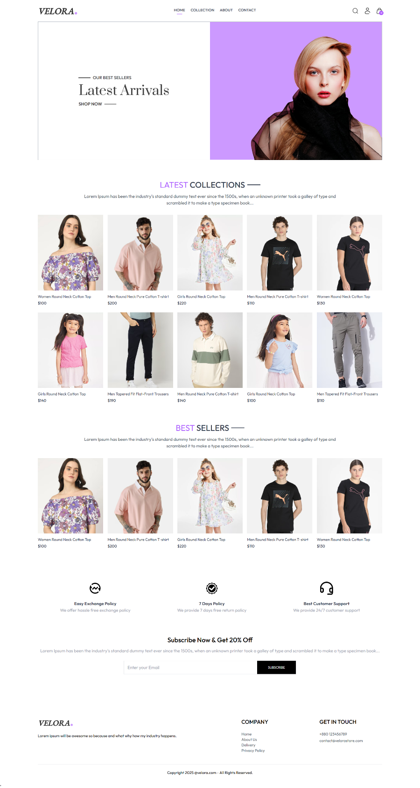

# Frontend (React + Vite) of the E-Commerce App

This project contains only the frontend of the E-commerce App for learning purposes.
Shoutout to @ [GreatStackDev](https://github.com/GreatStackDev) !

## Live Link - (Full Project with Backend)

<p align="center">
<br>
<a href="https://velora-store.vercel.app" target="_blank">Velora</a>
</p>

<!-- [Velora](https://velora-store.vercel.app) -->

## Features

- **Login**: Displays login/sign up page.
- **Home Page**: Displays an overview of store products.
- **Collection Page**: Allows users to filter products of their wish.
- **Product Page**: Allows users to view and add products to their cart.
- **About Us Page**: Displays company about page.
- **Contact Page**: Displays company contact information page.
- **Cart Page**: Allows users to edit or delete products from the cart.
- **Navigation Bar**: Seamless navigation between the app’s main pages.

## Languages, Build Tools and IDE
- React
- Tailwind CSS
- Vite
- VS Code

## Screenshots



### Clone the Repository

```bash
git clone https://github.com/afia45/ecommerce-app-react-frontend.git
cd ecommerce-app-react-frontend
cd frontend
npm run dev
```

### Self-Made Documentation


